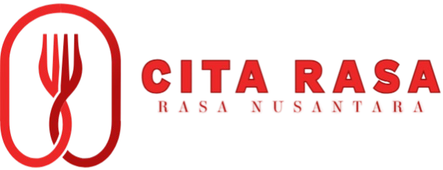

> **Ringkasan singkat:** Cita Rasa - Khas Nusantara adalah platform web kuliner interaktif yang menghadirkan ragam resep tradisional otentik dari berbagai daerah di Indonesia. Mulai dari kelezatan kuliner Sumatra, Jawa, hingga Papua, platform ini dirancang untuk memudahkan para pencinta kuliner dalam menemukan, mempelajari, dan melestarikan warisan resep nenek moyang dengan tampilan yang modern dan responsif.

---

## Tampilan & Demo (Screenshots)

| Beranda | Detail / Fitur Utama |
| :---: | :---: |
|  |  |
| *Tampilan Utama Dashboard* | *Tampilan Detail Fitur* |

---

## Fitur Utama

- **Kinerja Tinggi:** Dioptimalkan untuk kecepatan dan responsivitas.
- **Desain Modern:** Antarmuka pengguna yang bersih dan intuitif.
- **Responsif:** Tampil dengan baik di perangkat desktop maupun seluler.
- **Aman:** Menjaga keamanan data pengguna sesuai standar.

---

## Teknologi yang Digunakan


- **Frontend:** React / HTML5 / CSS3 / Tailwind CSS
- **Backend:** Node.js / Express
- **Database:** PostgreSQL / MongoDB

---

## Cara Memulai (Installation)

### Prasyarat
Pastikan telah menginstal [Node.js](https://nodejs.org/) di perangkat Anda.

### Langkah-langkah

1. **Clone repositori ini:**
   ```bash
   git clone https://github.com/username/repository-name.git
   cd repository-name
   ```

2. **Instal dependensi:**
   ```bash
   npm install
   ```

3. **Jalankan aplikasi:**
   ```bash
   npm start
   ```

---

## Kontribusi

Kontribusi selalu terbuka! Silakan *fork* repositori ini dan buat *pull request* untuk memberikan saran atau perbaikan.

---

## Lisensi

Proyek ini dilisensikan di bawah [MIT License](LICENSE).